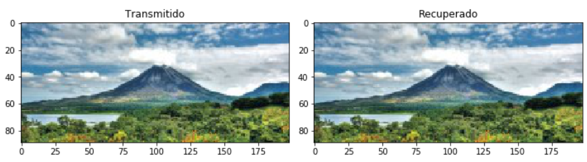
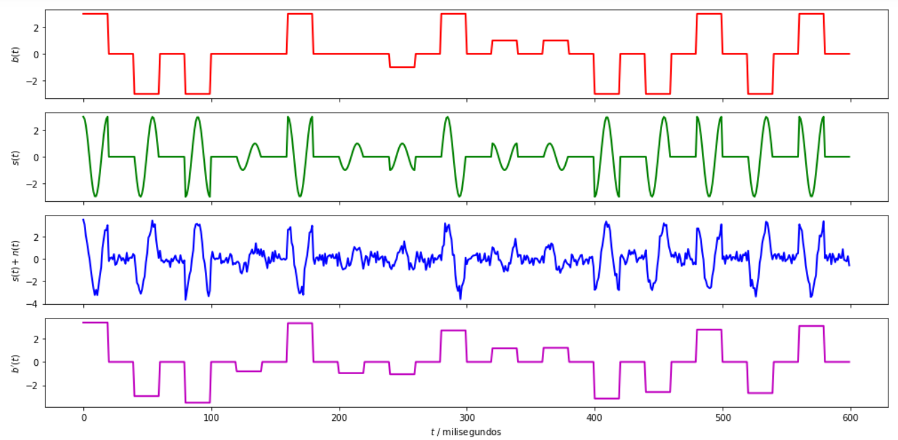
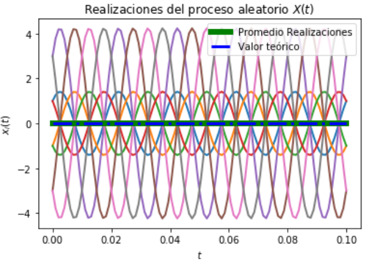
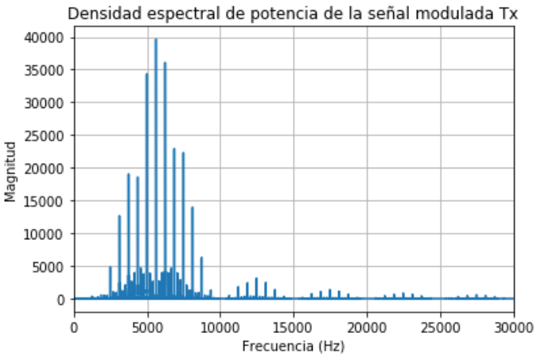

---

## Universidad de Costa Rica
### Escuela de Ingeniería Eléctrica
#### IE0405 - Modelos Probabilísticos de Señales y Sistemas

Primer semestre del 2021

---

* Estudiante: **Jordy Cordero Montero**
* Carné: **B72306**
* Grupo: **2**

---
## `Proyecto 4` - *Modulación digital 16-QAM*
>Se procederá a simular un **sistema de comunicaciones para la transmisión de imágenes de baja resolución** bajo el esquema de **modulación 16-QAM**.  

### - Asignaciones del proyecto

#### 1. Modulación 16-QAM

* (50%) Realice una simulación del sistema de comunicaciones como en la sección 3.2., pero utilizando una modulación 16-QAM en lugar de una modulación BPSK. Deben mostrarse las imágenes enviadas y recuperadas y las formas de onda.

Utilizando una modulación digital 16-QAM y tomando como base el código brindado por el profesor, se realizó la simulación de un sistema de comunicaciones para la transmisión de imágenes por medio de una serie de funciones implementadas en Python; donde en primer lugar se define la función llamada "fuente_info" que permite extraer los pixeles de la imagen que se desea transmitir, simulando una fuente de información. Luego se define la función "rgb_a_bit" que convierte los pixeles a una base binaria. Seguidamente se estipula un esquema de modulación por medio de la función "modulador16QAM" ,se realiza la modulación para cada señal portadora respectivamente y por medio de la función "senal_modulada" se realiza la suma de las señales provenientes de cada portadora para generar la senal_Tx. Ahora, se realiza la construcción de un canal con ruido AWGN por medio de la función "canal_ruidoso" que simula un medio de transmisión no ideal. Luego, se estipula un esquema de demodulación por medio de la función "demodulador16QAM" que simula un bloque demodulador de señales, bajo un esquema 16-QAM; este criterio de demodulación se basa en decodificación por detección de energía que permite reacomodar los bits en el orden que fueron tomados en el esquema de modulación. Finalmente, por medio de la función "bits_a_rgb" se decodifican los bits recuperados en el proceso de demodulación para la reconstrucción de la imagen; dicha imagen transmitida y recuperada se muestra a continuación:

El comportamiento de las señales se logra observar en la imagen que se muestra a continuación, donde b(t) representa  la señal moduladora, s(t) la señal transmitida, s(t)+n(t) la señal recibida que es la trnsmitida más el ruido y b'(t) la señal demodulada.

#### 2. Estacionaridad y ergodicidad

* (30%) Realice pruebas de estacionaridad y ergodicidad a la señal modulada senal_Tx y obtenga conclusiones sobre estas.

A través del código realizado en Python se logra encontrar el valor esperado temporal de la señal muestra (senal_Tx) y el promedio estadístico de las formas de onda posibles; éstos resultados se pueden observar en la imagen generada que se muestra a continuación:  

De acuerdo con los resultados obtenidos se observa que, tanto el valor esperado de la señal muestra cómo el de las formas de onda posibles, es constante en el tiempo adquiriendo un valor de cero. Además, se observa que como el promedio estadístico iguala al promedio temporal del proceso estocástico se puede denominar a s(t) como un proceso ergódico y por lo tanto estacionario.         

#### 3. Densidad espectral de potencia

* (20%) Determine y grafique la densidad espectral de potencia para la señal modulada `senal_Tx`.

En esta sección, utilizando el código brindado por el profesor como base, se determinó y graficó la densidad espectral de potencia, donde se comprueba que el máximo de potencia se consigue a 5000 Hz que es la frecuencia a la que viajan las portadoras, este resultado generado se logra observar a continuación:   

 
 >Nota: Resulta importante destacar que el código que implementa las soluciones del presente proyecto se encuentra disponible en el documento llamado P4.py adjunto al repositorio llamado Proyecto4.
